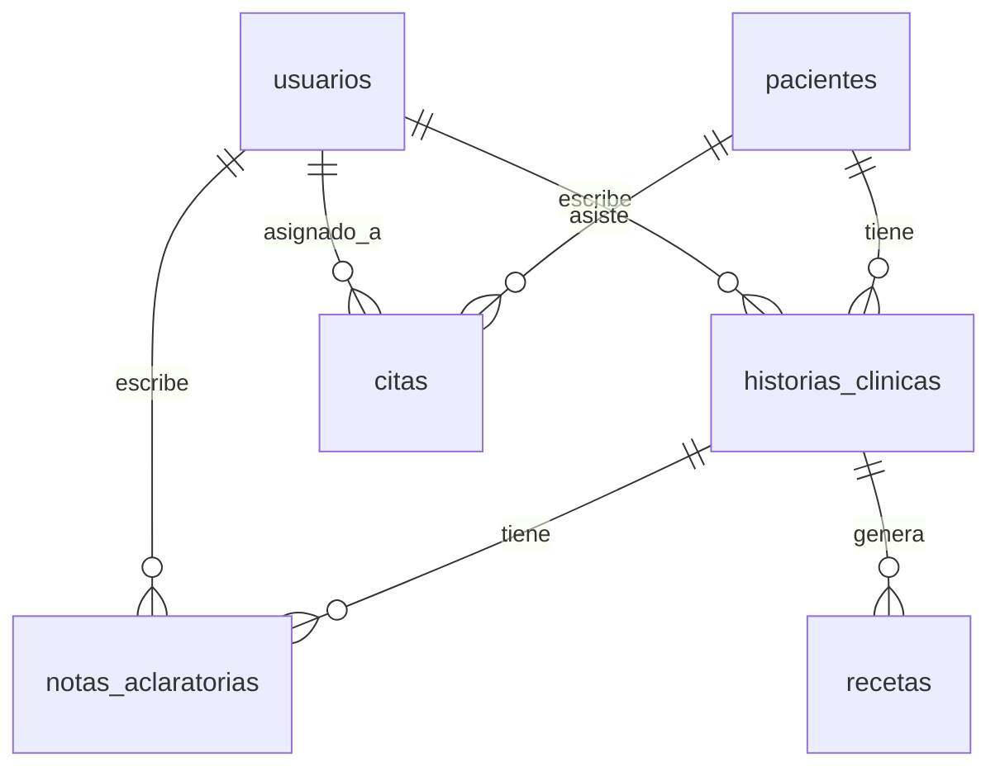

# Esquema de Base de Datos (PostgreSQL) - Nombres en Español

## Convenciones
*   **Identificadores**: UUID v4 para todos los IDs primarios (mayor seguridad).
*   **Auditoría**: Campos `fecha_creacion`, `fecha_actualizacion` en tablas mutables.
*   **JSONB**: Uso extensivo para estructuras flexibles.

## Tablas Principales

### 1. Usuarios y Roles (`usuarios`)
Gestiona el acceso al sistema.

| Columna | Tipo | Descripción |
| :--- | :--- | :--- |
| `id` | UUID (PK) | Identificador único |
| `nombre_usuario` | VARCHAR(50) | Nombre de usuario único |
| `hash_contrasena` | VARCHAR(255) | Hash bcrypt |
| `id_rol` | UUID (FK) | Referencia a tabla `roles` |
| `nombre_completo` | VARCHAR(100) | Nombre completo |
| `registro_medico` | VARCHAR(50) | Registro médico (Opcional) |
| `hash_firma_digital`| VARCHAR(255)| Hash de la firma digital (Opcional) |
| `url_imagen_sello` | VARCHAR(255)| URL/Path a la imagen del sello y firma escaneada |
| `esta_activo` | BOOLEAN | Control de acceso rápido |

### 1.1 Roles (`roles`)
Permite la creación dinámica de perfiles (Médico, Enf, Psicología, etc).

| Columna | Tipo | Descripción |
| :--- | :--- | :--- |
| `id` | UUID (PK) | Identificador único |
| `nombre` | VARCHAR(50) | 'MEDICO', 'ENFERMERIA', 'PSICOLOGIA', etc. |
| `permisos` | JSONB | Lista de permisos/capacidades del rol |
| `es_profesional_salud`| BOOLEAN | Indica si puede firmar historias |

### 2. Pacientes (`pacientes`)
Información demográfica y administrativa.

| Columna | Tipo | Descripción |
| :--- | :--- | :--- |
| `id` | UUID (PK) | Identificador único |
| `tipo_documento` | VARCHAR(10) | CC, TI, CE, etc. |
| `numero_documento` | VARCHAR(20) | Número de documento (Índice Único) |
| `nombres` | VARCHAR(100) | |
| `apellidos` | VARCHAR(100) | |
| `fecha_nacimiento` | DATE | Para cálculo de edad |
| `info_contacto` | JSONB | { "telefono": "...", "email": "...", "direccion": "..." } |
| `contacto_emergencia` | JSONB | Datos de contacto de emergencia |

### 3. Historias Clínicas (`historias_clinicas`)
Tabla central. Diseñada para INMUTABILIDAD una vez finalizada.

| Columna | Tipo | Descripción |
| :--- | :--- | :--- |
| `id` | UUID (PK) | Identificador único |
| `id_paciente` | UUID (FK) | Referencia a `pacientes` |
| `id_profesional` | UUID (FK) | Referencia a `usuarios` (Autor) |
| `fecha_creacion` | TIMESTAMP | Fecha de creación |
| `fecha_finalizacion` | TIMESTAMP | Fecha de cierre (Null = Borrador) |
| `estado` | ENUM | 'BORRADOR', 'FINALIZADA' |
| `tipo_plantilla` | VARCHAR(50) | 'GENERAL', 'PROCEDIMIENTO', etc. |
| `datos` | JSONB | Contenido dinámico { "anamnesis": "...", "examen_fisico": "..." } |
| `codigos_diagnostico` | JSONB | Array de códigos CIE-11 seleccionados |
| `hash_bloqueo` | VARCHAR(256) | Hash SHA-256 del contenido al finalizar (Integridad) |

> **Nota de Seguridad**: Una vez `estado` pasa a 'FINALIZADA', un trigger de base de datos debe impedir UPDATE o DELETE en esta fila.

### 4. Notas Aclaratorias (`notas_aclaratorias`)
Mecanismo legal para correcciones sin alterar el registro original.

| Columna | Tipo | Descripción |
| :--- | :--- | :--- |
| `id` | UUID (PK) | Identificador único |
| `id_historia` | UUID (FK) | Historia clínica asociada |
| `id_autor` | UUID (FK) | Profesional que hace la nota |
| `fecha_creacion` | TIMESTAMP | Fecha inmutable |
| `contenido` | TEXT | Texto de la aclaración |

### 5. Ayudas Diagnósticas (`resultados_examenes`)
Centraliza laboratorios e imágenes.

| Columna | Tipo | Descripción |
| :--- | :--- | :--- |
| `id` | UUID (PK) | Identificador único |
| `id_paciente` | UUID (FK) | Paciente |
| `id_profesional_ordena`| UUID (FK) | Quien pidió el examen |
| `id_profesional_realiza`| UUID (FK) | Bacteriólogo/Radiólogo |
| `tipo_examen` | VARCHAR(50) | 'LABORATORIO', 'IMAGENOLOGIA' |
| `codigo_cups` | VARCHAR(20) | Código del procedimiento realizado |
| `resultado_texto` | TEXT | Informe escrito / Interpretación |
| `archivos_adjuntos` | JSONB | Lista de URLs a imágenes/PDFs [{ "url": "...", "tipo": "pdf" }] |
| `fecha_realizacion` | TIMESTAMP | Fecha del reporte |

### 6. Recetas (`recetas`)

| Columna | Tipo | Descripción |
| :--- | :--- | :--- |
| `id` | UUID (PK) | Identificador único |
| `id_historia` | UUID (FK) | Historia clínica contexto |
| `medicamentos` | JSONB | Lista [{ "farmaco": "...", "dosis": "...", "duracion": "..." }] |
| `ruta_pdf_generado`| VARCHAR(255)| Ruta al archivo generado (si aplica) |

### 6. Citas (`citas`)

| Columna | Tipo | Descripción |
| :--- | :--- | :--- |
| `id` | UUID (PK) | Identificador único |
| `id_paciente` | UUID (FK) | Paciente |
| `id_profesional` | UUID (FK) | Médico asignado |
| `id_procedimiento_cups`| UUID (FK) | (Opcional) Procedimiento a realizar |
| `fecha_inicio` | TIMESTAMP | Inicio cita |
| `fecha_fin` | TIMESTAMP | Fin cita |
| `estado` | ENUM | 'PROGRAMADA', 'CONFIRMADA', 'CANCELADA', 'COMPLETADA', 'NO_ASISTIO' |
| `notas` | TEXT | Notas administrativas |

### 7. Gestión Financiera (`facturacion`)

#### 7.1 Tarifarios (`tarifarios`)
Base de datos de precios (ej. SOAT).

| Columna | Tipo | Descripción |
| :--- | :--- | :--- |
| `codigo` | VARCHAR(20) (PK)| Código del servicio/procedimiento |
| `descripcion` | VARCHAR(255) | Nombre del servicio |
| `valor_base` | DECIMAL | Valor monetario (ajustable por SMDLV) |
| `tipo_manual` | VARCHAR(50) | 'SOAT_2024', 'ISS_2001', 'PARTICULAR' |

#### 7.2 Facturas (`facturas`)
Cabecera de documento de cobro.

| Columna | Tipo | Descripción |
| :--- | :--- | :--- |
| `id` | UUID (PK) | Identificador único |
| `id_paciente` | UUID (FK) | Cliente |
| `id_cita` | UUID (FK) | (Opcional) Vinculación a la atención |
| `fecha_emision` | TIMESTAMP | Fecha de creación |
| `total` | DECIMAL | Valor total a pagar |
| `estado` | ENUM | 'PENDIENTE', 'PAGADA', 'ANULADA' |

#### 7.3 Detalles de Factura (`items_factura`)

| Columna | Tipo | Descripción |
| :--- | :--- | :--- |
| `id` | UUID (PK) | Identificador único |
| `id_factura` | UUID (FK) | Cabecera |
| `codigo_servicio` | VARCHAR(20) | Referencia a `tarifarios` o libre |
| `cantidad` | INT | Número de unidades |
| `valor_unitario` | DECIMAL | Precio por unidad |
| `valor_total` | DECIMAL | Calculado |

### 8. Talento Humano (`rrhh`)

#### 8.1 Contratos (`contratos`)
Vinculación laboral de profesionales.

| Columna | Tipo | Descripción |
| :--- | :--- | :--- |
| `id` | UUID (PK) | Identificador único |
| `id_profesional` | UUID (FK) | Empleado |
| `tipo` | VARCHAR(20) | 'NOMINA', 'OPS' |
| `salario_basico` | DECIMAL | (Nómina) Valor mensual |
| `valor_hora` | DECIMAL | (Nómina) Base cálculo horas extras |
| `tarifas_ops` | JSONB | (OPS) { "codigo_cups": valor_pago } |
| `activo` | BOOLEAN | Estado del contrato |

#### 8.2 Turnos y Horarios (`turnos`)
Definición de disponibilidad.

| Columna | Tipo | Descripción |
| :--- | :--- | :--- |
| `id` | UUID (PK) | Identificador único |
| `id_profesional` | UUID (FK) | Profesional |
| `dia_semana` | INT | 0=Dom, 1=Lun, etc. |
| `hora_inicio` | TIME | Inicio jornada |
| `hora_fin` | TIME | Fin jornada |
| `es_festivo` | BOOLEAN | Para cálculo de recargos |

#### 8.3 Liquidación de Honorarios (`liquidaciones`)

| Columna | Tipo | Descripción |
| :--- | :--- | :--- |
| `id` | UUID (PK) | Identificador único |
| `id_contrato` | UUID (FK) | Contrato fuente |
| `periodo_inicio` | DATE | Fecha corte inicio |
| `periodo_fin` | DATE | Fecha corte fin |
| `total_horas` | DECIMAL | (Nómina) Horas trabajadas |
| `total_extras` | DECIMAL | (Nómina) Valor horas extra |
| `total_procedimientos`| INT | (OPS) Cantidad eventos |
| `total_pagar` | DECIMAL | Valor neto a pagar |
| `estado` | ENUM | 'BORRADOR', 'APROBADO', 'PAGADO' |

### 9. Catálogos y Configuración

#### 7.1 Catálogo CUPS (`catalogo_cups`)
Códigos Únicos de Procedimientos en Salud.

| Columna | Tipo | Descripción |
| :--- | :--- | :--- |
| `codigo` | VARCHAR(20) (PK)| Código oficial (ej: 890201) |
| `descripcion` | TEXT | Nombre del procedimiento |
| `grupo` | VARCHAR(100) | Categoría del procedimiento |

#### 7.2 Configuración Institucional (`configuracion`)
Datos para encabezados y generación de RIPS.

| Columna | Tipo | Descripción |
| :--- | :--- | :--- |
| `clave` | VARCHAR(50) (PK)| 'NIT', 'CODIGO_HABILITACION', 'RAZON_SOCIAL' |
| `valor` | TEXT | Valor del parámetro |

#### 7.3 Plantillas de Historia (`plantillas_hc`)
Definición de modelos de historia clínica personalizados.

| Columna | Tipo | Descripción |
| :--- | :--- | :--- |
| `id` | UUID (PK) | Identificador único |
| `nombre` | VARCHAR(100) | 'Historia General', 'Control Prenatal', etc. |
| `estructura` | JSONB | Schema form definition (Campos, Secciones, Requeridos) |
| `activa` | BOOLEAN | Si está disponible para uso |

## Relaciones Críticas (Mermaid)

